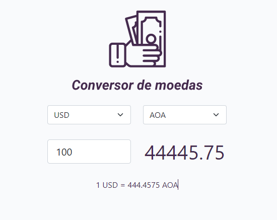

<h1> Conversor de moedas </h1>

   
 Projecto feito com <b>html, css e javascript </b> usando a API da Exchangerate para pegar os cambios actuais das moedas

   
 Este projecto foi feito seguindo as intruções de Roger Melo : https://www.youtube.com/watch?v=ExK7mUmfdeM

 

    
 

